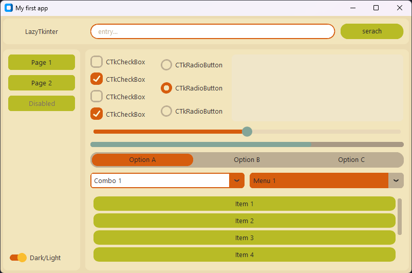
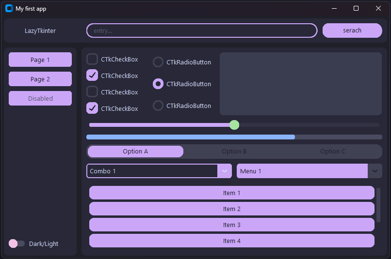
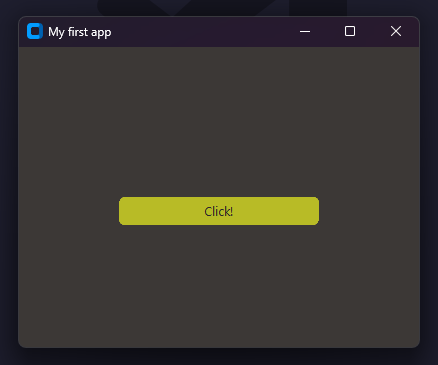

# 🦥 LazyTkinter


---

**LazyTkinter** 是一个基于 CustomTkinter 的 Python 界面库，旨在通过声明式编程简化 Tkinter 的布局和开发流程。它去除了传统的 grid 和 pack 方法，引入了 Row 和 Column 容器，仿照 HTML 的设计理念，增加了 padding 和 margin，使布局更加直观。
> LazyTkinter is a Python UI library built on CustomTkinter, designed to simplify Tkinter layout and development workflows via Declarative Programming. 
It replaces traditional grid and pack methods with Row and Column containers, adopting HTML-like design concepts (adding padding and margin) to make layouts more intuitive.

**目标受众**：适合希望快速开发简单 GUI 应用的开发者，尤其是对命令式编程感到繁琐，但又不想使用 PySide 或 QT 等大型框架的用户。
> Ideal for developers looking to quickly build simple GUI applications — especially those who find Imperative Programming cumbersome, but don’t want to use heavyweight frameworks like PySide or QT.

**未来计划**：如果项目有后续更新，会先修复其中的一些bug，比如宽高的设置，然后会增加锚点功能，使得布局更加灵活。最后就是增加更多组件等。
> If the project receives further updates, we will first fix existing bugs (e.g., width/height configuration), then add Anchor Functionality to make layouts more flexible, and finally expand the library with additional widgets.



---

## ⚠️ 免责声明 / Disclaimer

**这是一个实验性项目。** 
**This is an experimental project.**

这是我个人开发的第一个开源项目，LazyTkinter 主要用于探索声明式 UI 在 Python 中的实现。

- ❌ **不保证** 长期维护或更新。
- ❌ **不建议** 在生产环境中使用。
- ✅ **欢迎** 学习、Fork 或作为灵感参考。

如果你对项目感兴趣，可以关注后续更新~

---

## ✨ 核心特性 / Core Features

- **链式调用 (Fluent Interface)**: 简化属性设置，一行代码搞定。
  
  ```python
  ltk.Button().text("Click").width(100).event(func)
  ```

- **声明式布局(Declarative Layout)**: 提供 `Row` 和 `Column` 容器，无需手写复杂的 `grid` 参数。
  
  ```python
  ltk.Row(ltk.Button(), ltk.Label())
  ```

- **零依赖感 (Zero Dependency Feeling)**: 直接通过 `lazytkinter` 导出常用变量 (`StringVar`) 和工具，无需额外导入 `customtkinter`。

- **内置主题 (Built-in Themes)**: 开箱即用的 `Catppuccin`, `Gruvbox`, `Nord` 等配色方案。

- **自动滚动 (Auto Scroll)**: `ScrollableColumn` 让长列表布局变得极其简单。

---

## 🎨 内置主题 / Built-in Themes

LazyTkinter 内置了以下社区热门主题，无需下载 JSON 文件即可直接使用：

- `ltk.Theme.Catppuccin` (Catppuccin Mocha) 温馨且现代的配色方案。
  

- `ltk.Theme.Gruvbox` 经典的复古风格配色。
  

- 以及 CustomTkinter 原生的 `Blue`, `Green`, `DarkBlue`

---

## 🛠️ 组件支持 / Widget Support

**布局组件 / Layout Widgets**

* 📐 `Row`

* 📐 `Column`

* 📐 `ScrollableColumn`

* 📐 `Empty` (占位符)

**基础组件 / Basic Widgets**

* 🎯 `Button`

* 🎯 `Label`

* 🎯 `Entry`

* 🎯 `Textbox`

**选择组件 / Selection Widgets**

* 🎯 `Switch`

* 🎯 `CheckBox`

* 🎯 `RadioButton`

* 🎯 `SegmentedButton`

**选择列表组件 / Selection List Widgets**

* 🎯 `ComboBox`

* 🎯 `OptionMenu`

**数值组件 / Numeric Widgets**

* 🎯 `Slider`

* 🎯 `ProgressBar`

---

## 📂 项目结构

```Plaintext
lazytkinter/
├── __init__.py      # Unified export interface
├── app.py           # Application & Window wrapper
├── widgets.py       # Basic widget wrapper
├── containers.py    # Layout container wrapper
├── utils.py         # Utility classes (Image, StringVar)
└── themes/          # Built-in JSON theme files
```

---

## 📦 安装 / Installation

将项目克隆到本地，依赖 CustomTkinter 运行：

```bash
git clone https://github.com/JiangMingQin/lazytkinter.git
cd lazytkinter
pip install customtkinter>=5.2.0
```

---

## 🚀 示例程序 / Example Program

以下是一个简单的示例程序，展示如何使用 LazyTkinter 创建一个带有按钮的窗口：

1. **设置主题 / Set Theme**：
   
   ```python
   import lazytkinter as ltk 
   ltk.set_theme(ltk.Theme.Gruvbox) 
   ```

2. **创建应用实例 / Create Application Instance**：
   
   ```python
   app = ltk.Application() 
   ```

3. **定义事件函数 / Define Event Function**：
   
   ```python
   def on_click():
       print("click!")
   ```

4. **构建 UI / Build UI**：
   
   ```python
   app.window_size( # set window size
           "400x300"
       ).window_title( # set title
           "My first app"
       ).column( # vertical arrangment
           ltk.Button().margin((100, 150)).weight(0).text("Click!").event(on_click) 
       )
   ```

5. **运行应用 / Run Application**：
   
   ```python
   app.run()
   ```

**完整示例**

```python
import lazytkinter as ltk 

ltk.set_theme(ltk.Theme.Gruvbox) # set theme

# create program
app = ltk.Application()

# creat event
def on_click():
    print("click!")

# build UI
app.window_size( # set window size
        "400x300"
    ).window_title( # set title
        "My first app"
    ).column( # vertical arrangment
        ltk.Button().margin((100, 150)).weight(0).text("Click!").event(on_click) 
    )

# run
app.run()
```

运行后你会看到这样的窗口：



当你点击按钮的时候，终端应该会输出：

```bash
> click!
```

---

## 🤝 贡献 (Contributing)

欢迎 Fork 本项目并根据自己的想法进行修改！如果你发现 Bug 或有改进建议，可以通过以下方式参与：

1. **提交 Issue / Submit Issue**：描述问题或建议改进的功能。

2. **提交 PR / Submit PR**：修复 Bug 或添加新功能。请确保代码风格一致，并附上测试用例。

虽然我可能无法立即处理每个 PR，但我会尽力回复每条 Issue 和讨论！感谢你的支持！

---

## 📄 许可证 (License)

本项目基于 [MIT License](https://opensource.org/licenses/MIT) 开源。底层依赖 CustomTkinter 遵循其原有协议。这意味着你可以自由使用、修改和分发本项目，但需保留原许可证声明。

---

**Made with ❤️ by a foolish third-year university student.**

（由一位普通的大三学生开发，希望你喜欢这个项目！）
