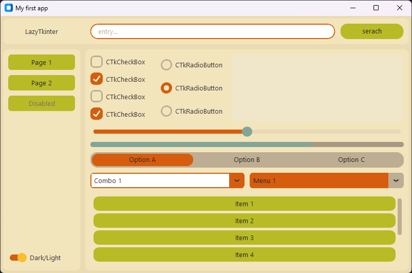
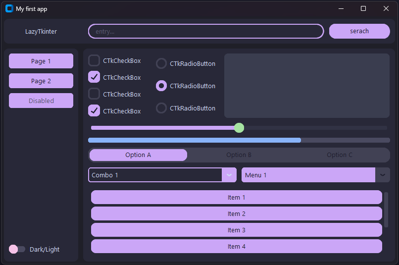
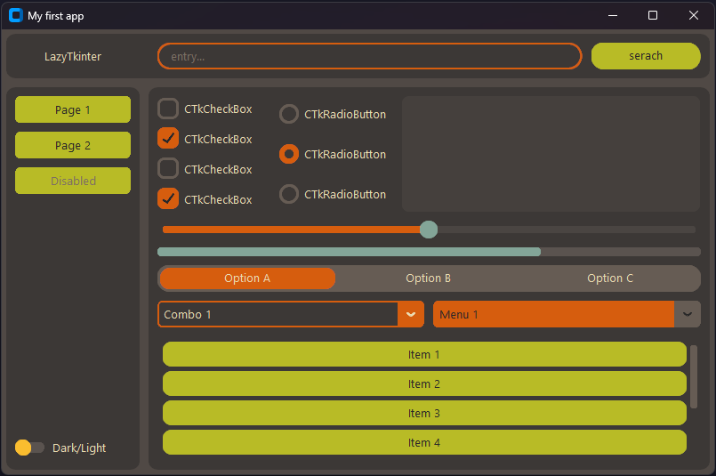
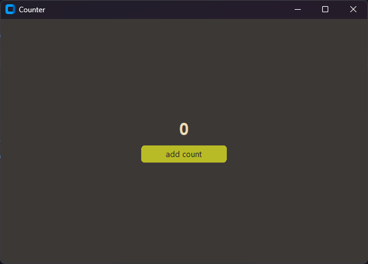

# 🦥 LazyTkinter


---

**LazyTkinter** 是一个基于 CustomTkinter 的 Python 界面库，旨在通过声明式编程简化 Tkinter 的布局和开发流程。它去除了传统的 grid 和 pack 方法，引入了 `Row` / `Column` / `ZStack` 容器，配合 `fit` / `fill` 尺寸策略、`gap` / `padding` 间距和 `Space` 占位（弹性/固定），使布局像搭积木一样直观。
> LazyTkinter is a Python UI library built on CustomTkinter, designed to simplify Tkinter layout and development workflows via Declarative Programming. 
It replaces traditional grid and pack methods with Row/Column/ZStack containers, fit/fill size policies, gap/padding spacing and Space placeholders to make layouts more intuitive.

**目标受众**：适合希望快速开发简单 GUI 应用的开发者，尤其是对命令式编程感到繁琐，但又不想使用 PySide 或 QT 等大型框架的用户。
> Ideal for developers looking to quickly build simple GUI applications — especially those who find Imperative Programming cumbersome, but don’t want to use heavyweight frameworks like PySide or QT.

**未来计划**：宽高设置问题已修复，锚点功能已通过 `align` / `ZStack` 实现。接下来会优先补充数据型控件（`Treeview` / `Listbox`）解决大列表性能问题，再增加控件引用机制（`.id()` + `app.get()`）与语义化主题 token，最后扩展更多组件。
> Width/height configuration is fixed and Anchor Functionality is now provided via `align` / `ZStack`. Next steps: data widgets (Treeview/Listbox) for large lists, widget references (`.id()` + `app.get()`), semantic theme tokens, and more widgets.



---

## ⚠️ 免责声明 / Disclaimer

**这是一个实验性项目。** 
**This is an experimental project.**

这是我个人开发的第一个开源项目，LazyTkinter 主要用于探索声明式 UI 在 Python 中的实现。

- ❌ **不保证** 长期维护或更新。
- ❌ **不建议** 在生产环境中使用。
- ✅ **欢迎** 学习、Fork 或作为灵感参考。

如果你对项目感兴趣，可以关注后续更新~

---

## ✨ 核心特性 / Core Features

- **链式调用 (Fluent Interface)**: 简化属性设置，一行代码搞定。
  
  ```python
  ltk.Button().text("Click").width(100).event(func)
  ```

- **可发现的尺寸策略 (Discoverable Size Policy)**: `width()` / `height()` 后可继续链出 `.fill()` / `.fit()`，配合 IDE 补全无需查文档；也支持固定像素 `width(120)`。控件与布局容器统一可用。
  
  ```python
  ltk.Button().width().fill()   # 宽度 fill，高度保持 fit
  ltk.Column().width().fit()    # 覆盖 Column 默认 fill，改为包裹内容
  ltk.Button().fill()           # 两轴都 fill
  ltk.Button().fill(weight=2)   # fill 且按 2 份参与主轴空间分配（默认等分）
  ```

- **声明式布局(Declarative Layout)**: 提供 `Row` 和 `Column` 容器，无需手写复杂的 `grid` 参数。
  
  ```python
  ltk.Row(ltk.Button(), ltk.Label())
  ```

- **对齐语义 (Alignment Semantics)**: `align` 控制**交叉轴**（Column 管左右、Row 管上下），`justify` 控制**主轴**（Column 管上下、Row 管左右，`center`/`end` 会自动把该轴转为 `fill` 以产生可分配空间），`.center()` 一步上下左右居中。`Application` 同样支持 `gap`/`align`/`justify`/`center()`，直接作用于根 `column()`/`row()`，无需再包一层容器。

- **零依赖感 (Zero Dependency Feeling)**: 直接通过 `lazytkinter` 导出常用变量 (`StringVar`) 和工具，无需额外导入 `customtkinter`。

- **事件约定 (Event Convention)**: 所有控件的 `event()` 回调统一接收“当前值”——`Button` 收到 `None`，选择类控件收到选中值。

- **内置主题 (Built-in Themes)**: 开箱即用的 `Catppuccin`, `Gruvbox`, `Nord` 等配色方案。

- **语义化主题 token (Semantic Tokens)**: 颜色可用语义名（如 `fg_color("primary")`），`ltk.color("primary")` / `ltk.Tokens.radius` 可读取当前主题的值。

- **自动滚动 (Auto Scroll)**: `Scroll` 包装任意单个子元素，长列表布局变得极其简单。

---

## 🎨 内置主题 / Built-in Themes

LazyTkinter 内置了以下社区热门主题，无需下载 JSON 文件即可直接使用：

- `ltk.Theme.Catppuccin` (Catppuccin Mocha) 温馨且现代的配色方案。
  

- `ltk.Theme.Gruvbox` 经典的复古风格配色。
  

- 以及 CustomTkinter 原生的 `Blue`, `Green`, `DarkBlue`

---

## 🛠️ 组件支持 / Widget Support

**布局组件 / Layout Widgets**

* 📐 `Row`

* 📐 `Column`

* 📐 `ZStack` (重叠层叠)

* 📐 `Space` (弹性/固定占位)

* 📐 `Scroll` (滚动包装器)

* 📐 `SplitPanel` (可拖拽分栏)

* 📐 `Divider` (分隔线)

**基础组件 / Basic Widgets**

* 🎯 `Button`

* 🎯 `Label`

* 🎯 `Entry`

* 🎯 `Textbox`

* 🎯 `Canvas` (画布)

**选择组件 / Selection Widgets**

* 🎯 `Switch`

* 🎯 `CheckBox`

* 🎯 `RadioButton`

* 🎯 `SegmentedButton`

**选择列表组件 / Selection List Widgets**

* 🎯 `ComboBox`

* 🎯 `OptionMenu`

**数值组件 / Numeric Widgets**

* 🎯 `Slider`

* 🎯 `ProgressBar`

**数据组件 / Data Widgets**（试验功能：系统控件渲染，可能与主题风格不统一）

* 📊 `Treeview` (表格, 试验)

* 📊 `Listbox` (列表, 试验)

---

## 📖 布局 API 速查 / Layout API Quick Reference

**尺寸策略 / Size Policy** — `width` / `height` 接受 `int`（固定像素）、`"fit"`（包裹内容）或 `"fill"`（撑满父容器）：

```python
ltk.Button().width(120)           # 固定像素
ltk.Button().width("fill")        # 字符串形式
ltk.Button().width().fill()       # 链式形式（IDE 补全友好）
ltk.Button().fill(weight=2)       # 撑满并按 2 份参与主轴空间分配
```

默认：控件 `fit`；Column 宽度 `fill`；ZStack / Scroll 宽高 `fill`。

**间距 / Spacing** — 全部为整数像素：

```python
ltk.Column().gap(12).padding(16)  # 子元素间距 / 内边距
app.gap(8).padding(20)            # 窗口根布局的间距 / 内边距
```

**对齐 / Alignment**：

```python
ltk.Column().align("center")      # 交叉轴：Column 管左右（left/center/right）
ltk.Row().align("center")         # 交叉轴：Row 管上下（top/center/bottom）
ltk.Row().justify("center")       # 主轴：Row 管左右（start/center/end）
ltk.Column().center()             # = justify("center") + align("center")
app.center().column(...)          # 窗口根布局同样支持
```

**布局原语 / Layout Primitives**：

```python
ltk.Row(ltk.Button(), ltk.Label())        # 构造参数直接传子元素
ltk.Column().add(a).add(b)                # 或追加
ltk.ZStack().add(bg, fg.align("top-right"))  # 重叠 + 锚点
ltk.Space().weight(2)                     # 弹性弹簧（吃剩余空间）
ltk.Scroll(ltk.Column().add(*items))      # 滚动包装（v1 仅垂直）
ltk.Space().width(10)                     # 固定尺寸占位
ltk.Canvas().width(400).height(300).fg_color("surface_alt").draw(
    lambda c: c.create_rectangle(10, 10, 100, 100, fill=ltk.color("primary"))
)
ltk.SplitPanel().vertical()                       # 纵向切割=左右分栏
    .add(ltk.Column(...)).min_width(120).max_width(400).transparent()
    .add(ltk.Column(...)).min_width(200)
ltk.Divider()                                     # 水平分隔线（默认，主题 border 色）
ltk.Divider().vertical().line_width(2)            # 垂直分隔线（line_width 设粗细）
ltk.Button().id("btn")                    # 注册 id，app.get("btn") 可继续链式设置
app.get("btn").config(ltk.Label).text("新文本")  # .config(类型) 收窄类型 + 运行时校验
app.native("btn")                         # 需要时获取原生控件
```

> **Canvas 说明**：基于 `CTkCanvas`（即 `tk.Canvas` 子类，绘图性能一致）；`.draw(func)` 在构建后把原生画布交给回调绘制（可多次注册、按序执行），`.fg_color()` 设置画布背景，交互通过 `.id()` + `app.native(id).bind(...)`。

> **SplitPanel 说明**：基于 `ttk.Panedwindow`，方向按**切割线方向**定义（见下表）；构建时从当前 CTk 主题取色（`ctk.ThemeManager`，语义 token 兜底）设置分隔条颜色；默认开启 `proxy_sash`（拖动时显示幽灵分隔条、松开才落位，`.proxy_sash(False)` 关闭）；面板最小/最大尺寸在拖动结束后用 `sashpos` 自动回夹（ttk 无原生支持）；切换主题或明暗后需重建窗口生效。

| 方向 | 切割线 | 面板可用属性 | 底层 ttk orient |
| --- | --- | --- | --- |
| `.vertical()` | 竖线（左右分栏） | `min_width` / `max_width` | `horizontal` |
| `.horizontal()` | 横线（上下分栏） | `min_height` / `max_height` | `vertical` |

> **Divider 说明**：基于 `CTkFrame` 的薄层分隔线，默认色为当前主题 border（可用 `.fg_color()` 覆盖）；`.orientation().horizontal()/.vertical()` 链式设置方向（字符串形式保留），`.line_width()` 设置粗细。

**外观 / Appearance**：

```python
ltk.Column().fg_color("#313244").radius(10)  # 背景色 + 圆角（默认主题色）
ltk.Column().transparent()                  # 显式透明
ltk.Label().font(family="Arial", size=20, weight="bold")  # 字体关键字形式
ltk.Button().fg_color("primary")            # 颜色可用语义 token 名
ltk.Button().padding(8)                     # 内边距（映射 CTk border_spacing）
ltk.Button().width(100).height(30).fix_size()  # 锁定显式尺寸，防大字体撑大
ltk.color("primary")                        # 读取当前主题的 token 值
```

**数据型控件 / Data Widgets**（大列表性能优先，原生控件 + 主题化调色板）：

```python
ltk.Treeview().columns(["Item", "Value"]).rows([("a", 1), ("b", 2)]).event(cb)
ltk.Listbox().items(["a", "b"]).event(cb)
```

> **Treeview / Listbox（试验功能）**：使用系统控件（`ttk.Treeview` / `tk.Listbox`）渲染，性能优先，但**可能与 CTk 主题风格不完全统一**。构建时用 `native_theme_colors()` 调色板为每个实例生成唯一的 ttk style（`LTkData<N>.Treeview` 等）：表面/文字/边框/选中色跟随当前 CTk 主题；Listbox 为 tk 控件，同一调色板通过控件选项上色。应用每次创建时会自动把全局 ttk 主题切到 `clam`（Windows 默认 `vista` 主题忽略 Treeview/滚动条颜色，且 CustomTkinter 每次建窗都会重置 ttk 主题），因此所有 ttk 控件外观更扁平；切换主题或明暗后需重建窗口生效。

**窗口 / Window**：

```python
app.size("large").window_title("App").padding(10).gap(5).center().column(...)
# size: "fill" / "large" / "medium" / "small" / (w, h)
app.size((800, 600)).min_size(400, 300).max_size(1200, 900).resizable(False, False)
app.fixed_size()                            # 固定窗口大小（等价 resizable(False, False)）
```

---

## 📂 项目结构

```Plaintext
lazytkinter/
├── __init__.py      # Unified export interface
├── app.py           # Application & Window wrapper
├── widgets.py       # Basic widget wrapper
├── containers.py    # Layout container wrapper
├── renderer.py      # Renderer protocol & CTk implementation
├── utils.py         # Utility classes (Image, StringVar)
└── themes/          # Built-in JSON theme files
```

---

## 📦 安装 / Installation

将项目克隆到本地后安装（自动拉取 `customtkinter` 依赖）：

```bash
git clone https://github.com/JiangMingQin/lazytkinter.git
cd lazytkinter
pip install -e .          # 开发模式安装（含依赖）
```

也可以直接 `pip install .` 普通安装。

---

## 🚀 示例程序 / Example Program

以下是一个简单的示例程序，展示如何使用 LazyTkinter 创建一个带有按钮的窗口：

1. **设置主题 / Set Theme**：
   
   ```python
   import lazytkinter as ltk 
   ltk.set_theme(ltk.Theme.Gruvbox) 
   ```

2. **创建应用实例 / Create Application Instance**：
   
   ```python
   app = ltk.Application() 
   ```

3. **定义事件函数 / Define Event Function**：
   
   ```python
   def on_click():
       print("click!")
   ```

4. **构建 UI / Build UI**：
   
   ```python
   app.size( # set window size: "fill" / "large" / "medium" / "small" / (w, h)
           "small"
       ).window_title( # set title
           "My first app"
       ).center().column( # center on both axes at the window root
           ltk.Button().text("Click!").event(on_click),
       )
   ```

5. **运行应用 / Run Application**：
   
   ```python
   app.run()
   ```

**完整示例**

```python
import lazytkinter as ltk 

ltk.set_theme(ltk.Theme.Gruvbox) # set theme

# create program
app = ltk.Application()

# creat event
def on_click():
    print("click!")

# build UI
app.size( # set window size: "fill" / "large" / "medium" / "small" / (w, h)
        "small"
    ).window_title( # set title
        "My first app"
    ).center().column( # center on both axes at the window root
        ltk.Button().text("Click!").event(on_click),
    )

# run
app.run()
```

运行后你会看到这样的窗口：



当你点击按钮的时候，终端应该会输出：

```bash
> click!
```

---

## 🤝 贡献 (Contributing)

欢迎 Fork 本项目并根据自己的想法进行修改！如果你发现 Bug 或有改进建议，可以通过以下方式参与：

1. **提交 Issue / Submit Issue**：描述问题或建议改进的功能。

2. **提交 PR / Submit PR**：修复 Bug 或添加新功能。请确保代码风格一致，并附上测试用例。

虽然我可能无法立即处理每个 PR，但我会尽力回复每条 Issue 和讨论！感谢你的支持！

---

## 📄 许可证 (License)

本项目基于 [MIT License](https://opensource.org/licenses/MIT) 开源。底层依赖 CustomTkinter 遵循其原有协议。这意味着你可以自由使用、修改和分发本项目，但需保留原许可证声明。

---

**Made with ❤️ by a foolish third-year university student.**

（由一位普通的大三学生开发，希望你喜欢这个项目！）
